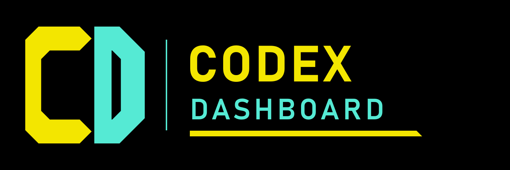
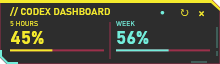
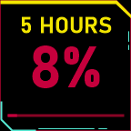
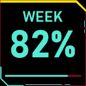
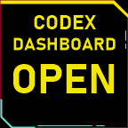
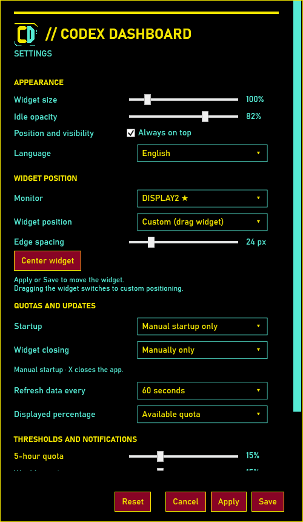

# Codex Dashboard

[Italiano](README.md) · [English](README.en.md)

**Keep Codex quotas visible, on your desktop and Stream Deck.**

Free, open-source Windows widget for five-hour and weekly quotas: percentages, renewal times, thresholds and local history. Stream Deck is optional.

**[Download the 2.0.7 installer](https://github.com/kentar91/CodexDashboard/releases/download/v2.0.7/CodexDashboard-Setup-2.0.7.exe)** · [All downloads](https://github.com/kentar91/CodexDashboard/releases/tag/v2.0.7) · [User guide](docs/USER_GUIDE.en.md)

**Windows 10/11 x64 · .NET Framework 4.8 · Codex installed and signed in.** No API key required. Optional plugin for Stream Deck 6.6+.

> Displays **Codex subscription quota percentages**, not exact token counts or API costs. Independent project, not affiliated with OpenAI, Elgato or CD PROJEKT RED.

## See it in action

Desktop widget, with quotas read from Codex:

Previews of the images sent to Stream Deck keys:

  

Percentages in the images are examples and change with usage.

Settings: language, appearance, position, thresholds and startup

## Which file should I download?

| Download | When to use it |
| --- | --- |
| [Installer — recommended](https://github.com/kentar91/CodexDashboard/releases/download/v2.0.7/CodexDashboard-Setup-2.0.7.exe) | Install or update the app, plugin or both; can create shortcuts. |
| [Portable ZIP](https://github.com/kentar91/CodexDashboard/releases/download/v2.0.7/CodexDashboard-2.0.7-windows-x64.zip) | Extract everything and run `CodexDashboard.exe`, without setup. Not needed if you use the installer. |
| [Stream Deck plugin only](https://github.com/kentar91/CodexDashboard/releases/download/v2.0.7/com.codexdashboard.monitor.streamDeckPlugin) | Open the package and confirm the import in Elgato. |

Additional downloads: [logo kit](https://github.com/kentar91/CodexDashboard/releases/download/v2.0.7/CodexDashboard-logo-kit.zip) · [SHA256SUMS.txt](https://github.com/kentar91/CodexDashboard/releases/download/v2.0.7/SHA256SUMS.txt).

Executables are **not digitally signed**. Checksums verify file integrity. GitHub’s **Source code** archives contain sources that require building: choose a download above to run the app immediately.

## First launch

1. Run setup and choose Italiano or English, then the components to install.
2. Launch **Codex Dashboard** using the shortcut created by the installer.
3. Open **Settings** by right-clicking the widget or using the tray menu.
4. If you use Stream Deck, confirm the import and add the three actions to keys.

Automatic startup and notifications are initially disabled. The widget works on its own; the plugin works with the widget closed. [Full instructions](docs/USER_GUIDE.en.md).

## Features

| Feature | Purpose |
| --- | --- |
| Compact widget | Five-hour and weekly quotas always visible, with configurable size, opacity and position |
| Stream Deck keys | Large percentages, manual refresh and widget launch |
| Available or used | Choose how percentages are displayed |
| Thresholds and notifications | Set separate alerts for both quotas |
| Local history | Charts for the last 24 hours or 7 days, up to 30 days of retention and CSV export |
| Startup and closing | Manual, Windows or Codex startup; optional closing when Codex closes |
| Italian and English | Interface, installer and documentation in both languages |
| Diagnostics | Connection status, last update and JSON export |

The HUD style is inspired by the Cyberpunk 2077 palette, with original artwork and readable percentages. This is an independent project, not affiliated with OpenAI, Elgato or CD PROJEKT RED.

## Data, compatibility and limits

The app reads quotas through `codex app-server`. It sends no prompts, does not read or copy authentication files, and does not spend reset credits. Settings and history stay in `%LOCALAPPDATA%/CodexDashboard`; uninstalling retains them. Review diagnostic details before posting them.

This milestone is for Windows; automatic online updates and Stream Deck+ dials are not supported. The connection depends on quota availability in the Codex app-server. Automated tests and live quota reading have been verified; physical hardware, different DPI and real reboot checks remain listed in the [verification notes](docs/VERIFICATION.en.md).

## Documentation and contributions

| Topic | Italiano | English |
| --- | --- | --- |
| Using the app | [Guida utente](docs/GUIDA.md) | [User guide](docs/USER_GUIDE.en.md) |
| Building and packaging | [Sviluppo](docs/SVILUPPO.md) | [Development](docs/DEVELOPMENT.en.md) |
| Source layout | [Struttura](docs/STRUTTURA.md) | [Structure](docs/STRUCTURE.en.md) |
| Theme and graphics | [Design](docs/DESIGN.md) | [Design](docs/DESIGN.en.md) |
| Tests and limits | [Verifiche](docs/VERIFICHE.md) | [Verification](docs/VERIFICATION.en.md) |

For problems or ideas, use the [issue templates](https://github.com/kentar91/CodexDashboard/issues/new/choose). To contribute, see [CONTRIBUTING.en.md](CONTRIBUTING.en.md). Italian and English are both welcome.

## Why I built this tool

I created Codex Dashboard for a practical reason: while working with Codex, I want to keep an eye on usage and know how much capacity I have left. Looking up that information repeatedly breaks my flow, especially during long sessions or when switching between several windows.

The idea is to bring this status directly to my workspace: a small widget visible while I work and, for Stream Deck users, large percentages on physical keys. Thresholds and history help track quota changes and plan work around the next renewal.

— **Kentar — k3ntarlab (GitHub: kentar91), project creator**

## Author and license

Created and maintained by **Kentar — k3ntarlab ([kentar91](https://github.com/kentar91))**. [MIT](LICENSE).
