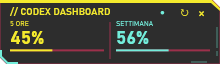
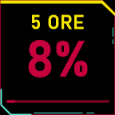
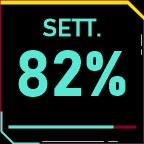
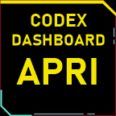
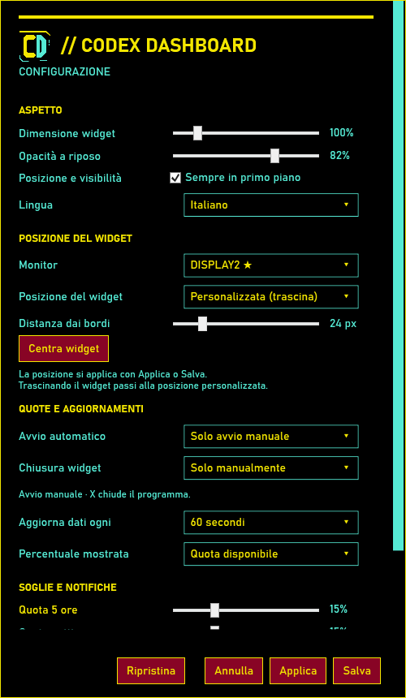

# Codex Dashboard

[Italiano](README.md) · [English](README.en.md)

**Le quote Codex sempre visibili, sul desktop e su Stream Deck.**

Widget Windows gratuito e open source per le quote su cinque ore e settimana: percentuali, rinnovi, soglie e storico locale. Stream Deck è facoltativo.

**[Scarica l’installer 2.0.7](https://github.com/kentar91/CodexDashboard/releases/download/v2.0.7/CodexDashboard-Setup-2.0.7.exe)** · [Tutti i download](https://github.com/kentar91/CodexDashboard/releases/tag/v2.0.7) · [Guida utente](docs/GUIDA.md)

**Windows 10/11 x64 · .NET Framework 4.8 · Codex installato e autenticato.** Nessuna chiave API richiesta. Plugin facoltativo per Stream Deck 6.6+.

> Mostra le **percentuali delle quote dell’abbonamento Codex**, non token esatti o costi API. Progetto indipendente, non affiliato a OpenAI, Elgato o CD PROJEKT RED.

## Come si presenta

Widget desktop, con quote lette da Codex:

Anteprime delle immagini inviate ai tasti Stream Deck:

  

Le percentuali nelle immagini sono esempi e cambiano con l’utilizzo.

Configuratore: lingua, aspetto, posizione, soglie e avvio

## Quale file scaricare?

| Download | Quando usarlo |
| --- | --- |
| [Installer — consigliato](https://github.com/kentar91/CodexDashboard/releases/download/v2.0.7/CodexDashboard-Setup-2.0.7.exe) | Installa o aggiorna il programma, il plugin oppure entrambi; può creare i collegamenti. |
| [ZIP portatile](https://github.com/kentar91/CodexDashboard/releases/download/v2.0.7/CodexDashboard-2.0.7-windows-x64.zip) | Estrai tutto e avvia `CodexDashboard.exe`, senza setup. Non serve se usi l’installer. |
| [Solo plugin Stream Deck](https://github.com/kentar91/CodexDashboard/releases/download/v2.0.7/com.codexdashboard.monitor.streamDeckPlugin) | Apri il pacchetto e conferma l’importazione in Elgato. |

Download aggiuntivi: [kit logo](https://github.com/kentar91/CodexDashboard/releases/download/v2.0.7/CodexDashboard-logo-kit.zip) · [SHA256SUMS.txt](https://github.com/kentar91/CodexDashboard/releases/download/v2.0.7/SHA256SUMS.txt).

Gli eseguibili **non sono firmati digitalmente**. I checksum verificano l’integrità dei file. Gli archivi **Source code** di GitHub contengono sorgenti da compilare: per usare subito il programma scegli uno dei download sopra.

## Primo avvio

1. Esegui il setup e scegli Italiano o English, poi i componenti da installare.
2. Avvia **Codex Dashboard** dal collegamento creato dall’installer.
3. Apri **Impostazioni** dal tasto destro sul widget o dal menu nell’area di notifica.
4. Se usi Stream Deck, conferma l’importazione e aggiungi le tre azioni ai tasti.

Avvio automatico e notifiche sono disattivati inizialmente. Il widget funziona da solo; il plugin può funzionare con il widget chiuso. [Istruzioni complete](docs/GUIDA.md).

## Cosa offre

| Funzione | Utilità |
| --- | --- |
| Widget compatto | Quote su cinque ore e settimana sempre visibili, con dimensione, opacità e posizione configurabili |
| Tasti Stream Deck | Percentuali grandi, aggiornamento manuale e apertura del widget |
| Disponibile o consumato | Scegli come leggere le percentuali |
| Soglie e notifiche | Imposta avvisi separati per le due quote |
| Storico locale | Grafici delle ultime 24 ore o 7 giorni, conservazione fino a 30 giorni ed esportazione CSV |
| Avvio e chiusura | Avvio manuale, con Windows o con Codex; chiusura facoltativa quando Codex si chiude |
| Italiano e inglese | Interfaccia, installer e documentazione in entrambe le lingue |
| Diagnostica | Stato della connessione, ultimo aggiornamento ed esportazione JSON |

Lo stile HUD è ispirato alla palette di Cyberpunk 2077, con grafica originale e percentuali leggibili. Il progetto è indipendente e non è affiliato a OpenAI, Elgato o CD PROJEKT RED.

## Dati, compatibilità e limiti

Il programma legge le quote attraverso `codex app-server`. Non invia prompt, non legge o copia i file di autenticazione e non consuma crediti di reset. Impostazioni e storico restano in `%LOCALAPPDATA%/CodexDashboard`; la disinstallazione li conserva. Controlla i dettagli della diagnostica prima di pubblicarla.

La milestone è per Windows; non include aggiornamenti online automatici o supporto alle manopole Stream Deck+. Il collegamento dipende dalla disponibilità delle quote nell’app-server Codex. I test automatici e la lettura reale sono stati verificati; prove su hardware fisico, DPI differenti e riavvio reale restano elencate nelle [verifiche](docs/VERIFICHE.md).

## Documentazione e contributi

| Argomento | Italiano | English |
| --- | --- | --- |
| Uso del programma | [Guida utente](docs/GUIDA.md) | [User guide](docs/USER_GUIDE.en.md) |
| Compilazione e pacchetti | [Sviluppo](docs/SVILUPPO.md) | [Development](docs/DEVELOPMENT.en.md) |
| Organizzazione sorgenti | [Struttura](docs/STRUTTURA.md) | [Structure](docs/STRUCTURE.en.md) |
| Tema e grafica | [Design](docs/DESIGN.md) | [Design](docs/DESIGN.en.md) |
| Test e limiti | [Verifiche](docs/VERIFICHE.md) | [Verification](docs/VERIFICATION.en.md) |

Per problemi o idee usa i [modelli di segnalazione](https://github.com/kentar91/CodexDashboard/issues/new/choose). Per contribuire consulta [CONTRIBUTING.md](CONTRIBUTING.md). Italiano e inglese sono entrambi benvenuti.

## Perché ho creato questo strumento

Ho creato Codex Dashboard per un'esigenza pratica: mentre lavoro con Codex, voglio avere sempre sott'occhio lo stato dell'utilizzo e sapere quanto margine mi rimane. Cercare queste informazioni ogni volta spezza il ritmo, soprattutto durante sessioni lunghe o quando passo fra più finestre.

L'idea è portare questo stato direttamente sulla scrivania: un piccolo widget visibile mentre lavoro e, per chi usa Stream Deck, percentuali grandi sui tasti fisici. Le soglie e lo storico aiutano a seguire l'andamento delle quote e a organizzare il lavoro in vista del prossimo rinnovo.

— **Kentar — k3ntarlab (GitHub: kentar91), creatore del progetto**

## Autore e licenza

Creato e mantenuto da **Kentar — k3ntarlab ([kentar91](https://github.com/kentar91))**. [MIT](LICENSE).
